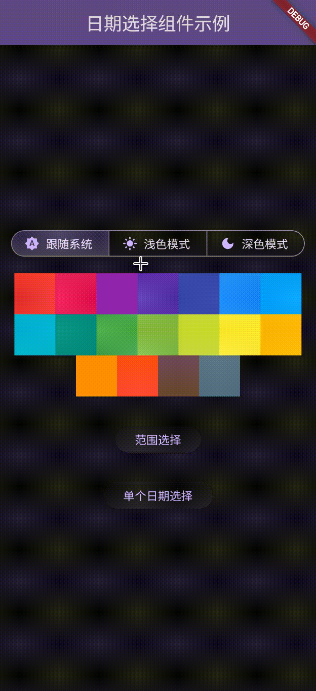

# Y Calendar

一个美观、易用的 Flutter 日历选择组件，支持单日期选择和日期范围选择。

## 特性

- ✅ 支持单日期选择
- ✅ 支持日期范围选择
- ✅ 支持深/浅色主题
- ✅ 支持 Material 风格主题
- ✅ 支持预设快捷选项

## 示例

预览地址：[knight-l.github.io/y_calendar/](https://knight-l.github.io/y_calendar/ "https://knight-l.github.io/y_calendar/")

|         范围选择         |         单日期选择         |         主题         |
| :----------------------: | :------------------------: | :------------------: |
|  |  |  |

完整的示例代码请查看 `example` 文件夹中的演示应用。

## 安装

在 `pubspec.yaml` 文件中添加依赖：

```yaml
dependencies:
  y_calendar: ^1.0.5
```

然后运行：

```bash
flutter pub get
```

## 使用方法

### 导入包

```dart
import 'package:y_calendar/y_calendar.dart';
```

### 单日期选择

```dart
ElevatedButton(
    onPressed: () async {
        DateTime? date = await YCalendar<DateTime>().showBottomSheet(
            context,
        );
        if (date != null) {
            data.value = DateFormat('yyyy-MM-dd').format(date);
        }
    },
    child: Text('单个日期选择'),
)
```

### 日期范围选择

```dart
ElevatedButton(
    onPressed: () async {
        List<DateTime>? date = await YCalendar<List<DateTime>>(
            presets: presets,
        ).showBottomSheet(context);
        if (date != null) {
            data.value = date.map(DateFormat('yyyy-MM-dd').format).toString();
        }
    },
    child: Text('范围选择'),
)
```

### 自定义配置

```dart
YCalendar<DateTime>(
    title: "选择日期",
    color: Colors.blue,
    minDate: DateTime(2024, 1, 1),
    maxDate: DateTime(2024, 12, 31),
    defaultDate: DateTime.now(),
    showConfirm: true,
    confirmText: "确认",
    closeOnClickOverlay: true,
    round: BorderRadius.vertical(top: Radius.circular(20.0)),
    height: 400.0,
).showBottomSheet(context)
```

## API 参数

| 参数                  | 类型                           | 默认值                                              | 描述                               |
| --------------------- | ------------------------------ | --------------------------------------------------- | ---------------------------------- |
| `title`               | `String`                       | "日期选择"                                          | 日历标题                           |
| `color`               | `Color?`                       | `null`                                              | 主题颜色，影响按钮和选中日期的颜色 |
| `minDate`             | `DateTime?`                    | 去年 1 月                                           | 最小可选日期                       |
| `maxDate`             | `DateTime?`                    | 明年 12 月                                          | 最大可选日期                       |
| `defaultDate`         | `T?`                           | `null`                                              | 默认选中的日期                     |
| `round`               | `BorderRadiusGeometry`         | `BorderRadius.vertical(top: Radius.circular(20.0))` | 弹窗圆角                           |
| `showConfirm`         | `bool`                         | `true`                                              | 是否显示确认按钮                   |
| `closeOnClickOverlay` | `bool`                         | `true`                                              | 是否允许点击遮罩层关闭             |
| `confirmText`         | `String`                       | "确定"                                              | 确认按钮文字                       |
| `height`              | `double`                       | `400.0`                                             | 日历高度                           |
| `presets`             | `Map<String, List<DateTime>>?` | `null`                                              | 预设选项                           |

## 泛型参数

- `YCalendar<DateTime>`: 单日期选择模式
- `YCalendar<List<DateTime>>`: 日期范围选择模式

## 依赖

- Flutter SDK: >=1.17.0
- Dart SDK: ^3.7.0
- intl: ^0.20.2

## 贡献

欢迎提交 Issue 和 Pull Request 来改进这个项目。

## 许可证

本项目采用 MIT 许可证。详情请查看 [LICENSE](LICENSE) 文件。
